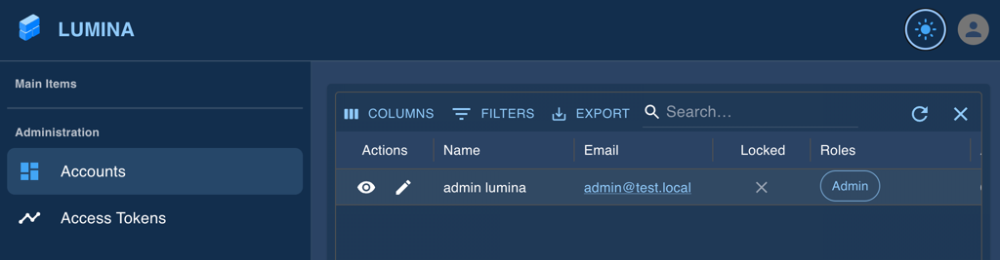

# Lumina

**Lumina** is a web application framework combining a React frontend with [Material UI](https://mui.com/) and a
[FastAPI](https://fastapi.tiangolo.com/) backend. It provides essential, secure functionality needed for most web
applications, including user management, access token handling, and session management. Designed to simplify and
accelerate development, Lumina serves as a solid foundation for quickly bootstrapping new web applications. Its
modular design makes it easy for anyone to adapt and build upon, whether for personal projects or professional use.



## Introduction

This repository is one of several repositories that make up the Lumina project. It contains the Docker specifications
and environment configurations necessary for setting up the development environment for Lumina. It enables a
streamlined local development experience but is not intended for production use.


## Microservices Overview

Lumina operates as a microservices-based application, utilizing several key services to deliver a fully integrated
experience:

| **Service**                                                    | **Description**                                                                                                                                                                                                            |
|----------------------------------------------------------------|----------------------------------------------------------------------------------------------------------------------------------------------------------------------------------------------------------------------------|
| **Database**                                                   | [PostgreSQL](https://www.postgresql.org/) database storing all application data, ensuring data consistency and reliability across Lumina services.                                                                         |
| **[Backend](https://github.com/chopicalqui/lumina-backend)**   | Backend service built with [FastAPI](https://fastapi.tiangolo.com/), providing secure and performant RESTful APIs that enable frontend interactions and core business logic.                                               |
| **[Frontend](https://github.com/chopicalqui/lumina-frontend)** | Web-based frontend application developed with [React](https://react.dev/), [TypeScript](https://www.typescriptlang.org/), and [Material UI (MUI)](https://mui.com/), offering an intuitive user interface for end users.   |
| **Identity Provider (IdP)**                                    | External IdP [Keycloak](https://www.keycloak.org/) used for independent user management and authentication, maintaining its own [PostgreSQL](https://www.postgresql.org/) database for secure, isolated user data storage. |
| **Reverse Proxy**                                              | [Nginx](https://nginx.org/en/) service configured to listen on the loopback interface (TCP port 8000), forwarding HTTP requests to the Frontend, Backend, and IdP.                                                         |
| **Message Broker**                                             | [Redis](https://redis.io/de/) instance used for asynchronous job handling, such as managing user notifications, to improve system responsiveness and efficiency.                                                           |
| **Test Database**                                              | Dedicated [PostgreSQL](https://www.postgresql.org/) database used by unittests to ensure it does not intervere with data stored in _Database_.                                                                             |

# Setup Development Environment

This section provides instructions for setting up the development environment for Lumina.

## Cloning DevOps Repository

Use the following command to clone repository [lumina-devops](./) and its submodules
[lumina-backend](https://github.com/chopicalqui/lumina-backend),
[lumina-frontend](https://github.com/chopicalqui/lumina-frontend), and 
[lumina-core](https://github.com/chopicalqui/lumina-core):

```bash
git clone --recurse-submodules git@github.com:chopicalqui/lumina-devops.git
```

## Setting Up Environment Variables

Before we can launch the development infrastructure, we need to set the following environment variables:

| **Ref.** | **File**                                    | **Environment Variable**  | **Description**                                                                                                                                  |
| -------- | ------------------------------------------- | ------------------------- | ------------------------------------------------------------------------------------------------------------------------------------------------ |
| 1        | [.env.backend](envs/.env.backend)           | `OAUTH2_SECRET_KEY`       | Secret used by _Backend_ to sign JSON Web Tokens (JWT).                                                                                          |
| 2        | [.env.backend](envs/.env.backend)           | `CLIENT_SECRET`           | Used by _Backend_ to authenticate to the _IdP_.                                                                                                  |
| 3        | [.env.backend.core](envs/.env.backend.core) | `POSTGRES_PASSWORD`       | Used by _Database_ to set password for user `lumina` as well as by _Backend_ to authenticate to _Database_.                                      |
| 4        | [.env.backend.core](envs/.env.backend.core) | `DATA_LOCATION`           | Used by _Backend_ for reading static data like [country-data.json](https://github.com/chopicalqui/lumina-core/blob/main/data/country-data.json). |
| 5        | [.env.pytest](envs/.env.pytest)             | `POSTGRES_PASSWORD`       | Used by _Test Database_ to set password for user `lumina` as well as by unittests authenticate to _Database_.                                    |
| 6        | [.env.pytest](envs/.env.pytest)             | `DATA_LOCATION`           | Used by unittests for reading static data like [country-data.json](https://github.com/chopicalqui/lumina-core/blob/main/data/country-data.json). |
| 7        | [.env.idp.db](envs/.env.idp.db)             | `POSTGRES_PASSWORD`       | Used by the _IdP_'s database to set password for user `keycloak`.                                                                                |
| 8        | [.env.idp](envs/.env.idp)                   | `KC_DB_PASSWORD`          | **Same password as in Ref. 7.** It is used by _IdP_ to connect to IdP database.                                                                  |
| 9        | [.env.idp](envs/.env.idp)                   | `KEYCLOAK_ADMIN_PASSWORD` | The password of administrative user `keycloak`. We can use this user to administer Keycloak via URL http://localhost:8000/idp.                   |

## Launching Development Environment

Once the environment variables are set, we can launch the development environment via the following command:

```bash
docker compose up
```

This will launch all microservices, except _Frontend_ and _Backend_ (see next section).

## Install Dependencies

In this section, we will install the dependencies for the _Backend_ and _Frontend_ microservices. They will run in the
host machine and not in Docker containers so that we can take advantage of hot-reloading and other development features.

### Python Backend

First, we navigate to the _Backend_ directory and there we create and activate a virtual environment.

```bash
cd app/backend/
python -m venv .venv
source .venv/bin/activate
cd ../..
```

Next, we install all dependencies using [Poetry](https://python-poetry.org/).

```bash
cd app/backend/
source .venv/bin/activate
python -m pip install poetry
poetry install --no-root
cd app/core
poetry install --no-root
cd ../../../..
```

### React Frontend

We navigate to the _Frontend_ directory and install all dependencies using `npm`.

```bash
cd app/frontend/
npm install
npm run dev
```
